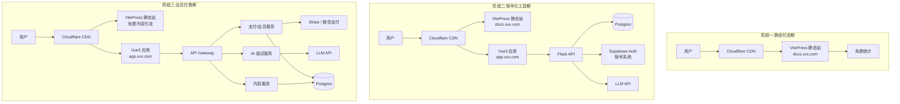

# 我是面试大王 · 架构与发展规划

> 对标产品:[labuladong.online](https://labuladong.online/zh/algo/home/)
> 模式本质:**内容引流 + 工具/服务变现**(不是内容本身收费)
> 文档基线时间:2026-08

---

## 一、项目现状基线

### 产品形态

| 模块 | 形态 | 位置 |
|------|------|------|
| 主站(知识库) | VitePress 静态文档 | `docs/` |
| 面试助手应用 | Vue3 + Vite 前端 / Flask 后端 | `frontend-interview-agent/` |
| 账号体系 | 已预留 users / guests 表 | `backend/interview_agent.db` |

### 技术栈

| 层 | 当前技术 | 备注 |
|---|---|---|
| 内容 | VitePress + markdown | 150+ 知识点,10+ 专栏 |
| 前端应用 | Vue3 + TypeScript + Vite + Tailwind | 端口 3000 |
| 后端 | Flask + Flask-CORS | 端口 5000,单体 |
| 存储 | SQLite | 单文件,够用但不支持并发写入 |
| 部署 | 未部署 | 本地开发阶段 |
| 仓库 | GitHub: handsomeyx/my-interview-king | |

### 内容盘点(已有护城河)

Java 基础 / 中间件(Redis、MySQL、Kafka)/ 分布式 / AI Agent / 算法 / 场景题 —— 覆盖面已经接近一个完整的 Java 后端面试知识图谱,这是后面一切商业化的流量基础。

---

## 二、核心战略原则(决策红线)

不管后面技术怎么变,这五条不动摇:

1. **内容永远免费,服务/工具收费**
   保护 SEO 引流护城河。任何「文章付费才能看」的诱惑都要顶住。

2. **静态站与付费应用物理分离**
   `xxx.com`(VitePress 静态)永远不变;付费功能进 `app.xxx.com`(动态应用)。两层互不拖累。

3. **不自己造用户/支付的轮子**
   早期自己写登录、支付、权限,投入产出比极差。用现成 SaaS。

4. **先验证流量,再做付费**
   没流量的付费产品没人买。内容跑通前,所有付费架构都是过早优化。

5. **保留架构后路**
   后端业务代码不要深度绑定 SQLite 特性,方便未来无痛换 Postgres。

---

## 三、三阶段演进路线

### 阶段一:MVP 静态引流期(0 ~ 6 个月)

**目标**:验证内容质量,积累 SEO 流量。**不碰任何付费。**

- [ ] VitePress 部署到 **Cloudflare Pages**(推荐,国内访问相对友好)或 Vercel —— 完全免费
- [ ] 绑定自定义域名(约 ¥80/年,越早越好,搜索引擎要从第一天就认你)
- [ ] 配置 SEO:`sitemap.xml`、`robots.txt`、结构化数据、Open Graph
- [ ] 接入免费统计:**Plausible 自建** 或 **Umami Cloud** 或 Google Analytics
- [ ] `frontend-interview-agent` 暂不上线,或仅作为静态 demo 展示
- [ ] 持续高频产出内容(每周 2 ~ 3 篇深度文章)

**北极星指标**:搜索引擎收录量、月 UV、内容数量

**预算**:≈ ¥100/年(域名)

### 阶段二:账号化 + 增值工具期(6 ~ 12 个月)

**目标**:留住用户,沉淀用户行为数据,提供轻互动工具。**仍然不收费,先建习惯。**

- [ ] `frontend-interview-agent` 正式上线,挂子域名 `app.xxx.com`
- [ ] 接入第三方账号体系(避免自己写):
  - 海外路线:**Supabase Auth** 或 **Clerk**
  - 国内路线:**腾讯云 / 阿里云账号体系**,或 **微信扫码登录**
- [ ] 数据库迁移:**SQLite → Postgres**(用 Supabase / Neon 免费档起步)
- [ ] 免费工具上线(都要免费):
  - 学习进度跟踪、收藏夹、笔记
  - AI 答疑助手(每日免费额度,如 10 次/天)
  - 刷题打卡日历
- [ ] 主站静态页内嵌「工具入口」CTA,把流量导向应用

**北极星指标**:注册用户数、7 日留存、WAU、人均阅读篇数

**预算**:≈ ¥100 ~ 500/月(数据库 + AI API 调用费)

### 阶段三:会员付费期(12 个月之后)

**目标**:商业化。**内容继续全免费,付费的是工具和服务。**

- [ ] 接入支付:
  - 国内:微信支付 + 支付宝官方接口,或聚合服务(如 Ping++)
  - 海外:**Stripe**(订阅、退款、发票全自动化)
- [ ] 会员体系(免费版 / Pro 版分级,见第六节)
- [ ] 付费功能矩阵:
  - 🤖 AI 模拟面试官(视频/语音/文字)
  - 📋 专属高频题库 + 企业标签
  - 📅 个人定制学习计划
  - 📄 PDF 离线下载包
  - 💬 1v1 答疑社群 / 知识星球
  - 📝 简历优化服务
- [ ] 若单体后端扛不住,按域拆服务(先拆出 AI 服务、支付服务)

**北极星指标**:付费转化率、ARPU、续费率、MRR

**预算**:按收入比例投入(建议早期带宽 + AI + 基础设施 ≤ 收入 30%)

---

## 四、架构演进图



---

## 五、技术选型建议

### 部署 & CDN

| 选项 | 优势 | 劣势 | 推荐 |
|------|------|------|------|
| Cloudflare Pages | 全球 CDN、免费额度大、国内可访问 | 构建较慢 | ⭐ 阶段一首选 |
| Vercel | 构建快、体验好 | 国内访问不稳 | 备选 |
| 国内云(阿里云/腾讯云) | 国内访问最快 | 需备案、收费 | 阶段三再考虑 |

### 账号系统

| 选项 | 适用场景 |
|------|---------|
| Supabase Auth | 海外用户、免费档够用、开箱即用 |
| Clerk | 体验最好、功能全,但贵 |
| 微信扫码登录 | 国内必备,体验好 |
| 自研 | ❌ 不推荐,投入产出比低 |

### 数据库演进

```
SQLite(现状)  ──阶段二──▶  Postgres(Supabase / Neon 免费档)
                              │
                              └──阶段三(数据量大)──▶  托管 Postgres + 只读副本 + Redis 缓存
```

### 支付

| 场景 | 推荐 |
|------|------|
| 国内个人 | 微信支付个人码(起步)、之后官方商户号 |
| 国内企业 | 微信支付 + 支付宝官方接口,或 Ping++ 聚合 |
| 海外 | Stripe(订阅、退款、发票全自动) |

### AI 调用(面试助手核心成本)

- 早期用 **DeepSeek / 通义千问 / Kimi**(国内、便宜、质量够)
- 高端场景用 Claude / GPT
- **必须做的优化**:prompt 缓存、流式输出、按用户分级限速、结果缓存

---

## 六、商业化设计(免费 vs 付费)

核心原则:**免费给够用、付费给爽**。免费版不能太抠,否则没人留下;付费版要有清晰的「升级感」。

| 功能 | 免费版 | Pro 版(建议 ¥99 ~ 199/年) |
|------|--------|--------------------------|
| 所有知识库文章 | ✅ 全部免费 | ✅ |
| 收藏 / 学习进度 | ✅ | ✅ |
| AI 答疑助手 | 10 次/天 | 无限次 |
| AI 模拟面试 | ❌ | ✅ 每周 N 次 |
| 学习计划定制 | ❌ | ✅ |
| 专属题库 + 企业标签 | ❌ | ✅ |
| PDF 离线下载 | ❌ | ✅ |
| 答疑社群 / 1v1 | ❌ | ✅ |

> 定价建议:第一年先定低价(¥99/年)冲用户量和口碑,第二年根据转化数据提价。**终身会员谨慎卖**,会拖垮长期 MRR。

---

## 七、避坑清单

这些都是同类站点踩过的坑,提前避开:

1. **不要做内容付费墙** —— 牺牲 SEO,等于自断流量来源,得不偿失。
2. **不要把 VitePress 改成动态 SPA** —— 静态优势丢了就回不来了。
3. **不要过早做微服务** —— 用户 < 1 万时单体 Flask 足够,过早拆服务是给自己挖坑。
4. **不要自己写支付** —— 对账、退款、发票、风控,自己写会耗光你所有时间。
5. **不要忽视 SEO** —— 标题、关键词、内链、外链,从第一篇文章就要做。
6. **备份!备份!备份!** —— 数据库每周自动备份到对象存储,养成习惯。
7. **域名和服务分离** —— 不要把域名注册、DNS、托管全押在一个服务商。
8. **内容版权** —— 进入付费阶段后,加水印、禁止右键、防爬虫,加大抄袭成本。

---

## 八、下一步行动清单(本月可做)

立即可执行,不需要等:

- [ ] 购买自定义域名(如 `xxx.com` 或 `xxx.cn`)
- [ ] 注册 Cloudflare 账号,把 VitePress 接入 Cloudflare Pages
- [ ] 配置自定义域名 + HTTPS(Cloudflare 自动)
- [ ] 在 `docs/.vitepress/config.ts` 中配置 `sitemap`、`head` 的 SEO meta
- [ ] 接入 Umami 或 Plausible 统计
- [ ] 提交站点到 Google Search Console、百度站长平台
- [ ] 每周稳定输出 2 ~ 3 篇高质量文章,坚持 3 个月再评估阶段二

---

## 九、关键指标看板(每季度复盘)

| 指标 | 阶段一目标 | 阶段二目标 | 阶段三目标 |
|------|-----------|-----------|-----------|
| 月 UV | 1 万 | 5 万 | 20 万 |
| 注册用户 | — | 2000 | 2 万 |
| 付费用户 | — | — | 500 |
| 内容篇数 | 100 | 200 | 300+ |
| 月收入 | ¥0 | ¥0(成本期) | ¥5 万+ |

---

*本文档随项目发展持续迭代。每个阶段完成后回来更新实际数据,修正下一阶段计划。*
